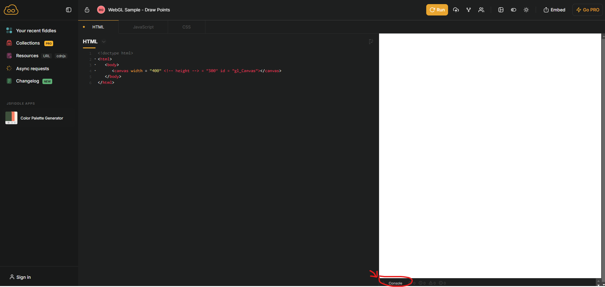
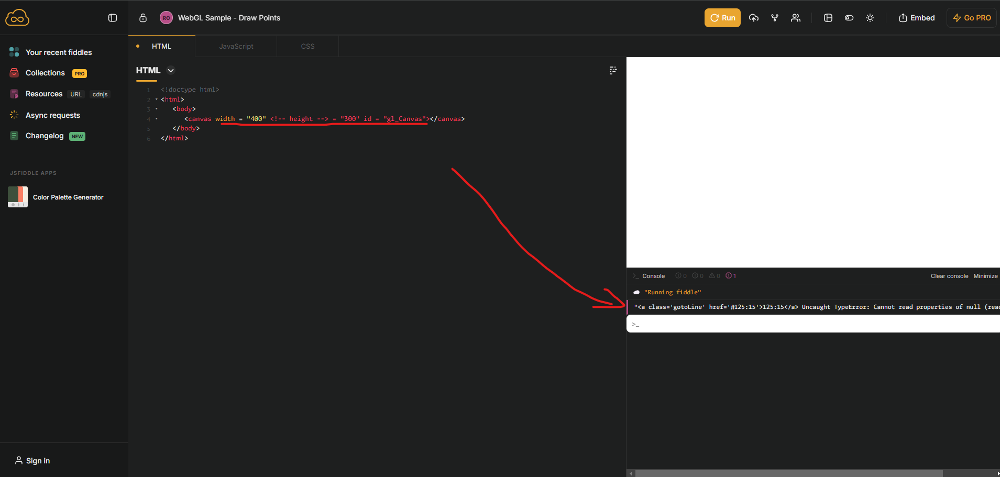

# Based on the sample program provided, look up the functions used and answer the following questions

1. The goal of the “ createShader ” function? Why do we have to pass code as a string to create shaders?
2. Explain the meaning & parameters (including value type & data range) of the following functions

   - gl.bufferData
   - gl.vertexAttribPointer
   - gl.viewport
  
3. In what form are colors in WebGL transmitted/used? What is the range of values of color parameters/color channels?

4. In the function “ clearGL ” what will happen when the line

    **gl.enable(gl.DEPTH_TEST)” is uncommented.**

5. When using Jsfilddle, if the program has an error (the code cannot run), how can we find out which line has the error?

## Answer

## **1. The goal of the “ createShader ” function? Why do we have to pass code as a string to create shaders?**

The goal of the `createShader` function is to encapsulate the process of creating, compiling, and verifying a shader in WebGL. Shaders are small programs that run on the GPU, and WebGL requires them to be written in GLSL (OpenGL Shading Language). The function takes the following steps:

1. **Create a Shader Object**:  
    It creates a shader object using `gl.createShader(type)`. This object represents either a vertex or fragment shader, as specified by the `type` parameter.

2. **Attach the Shader Source Code**:  
    The GLSL code (passed as the `source` string) is provided to the shader using `gl.shaderSource(shader, source)`.

3. **Compile the Shader**:  
    The shader is compiled using `gl.compileShader(shader)`. This transforms the GLSL code into a form the GPU can execute.

4. **Check for Compilation Success**:  
    The function checks if the compilation was successful using `gl.getShaderParameter  (shader, gl.COMPILE_STATUS)`. If not, it logs the error using `gl.getShaderInfoLog(shader)` and deletes the shader object to free resources.

5. **Return the Compiled Shader**:  
    If the compilation is successful, the function returns the shader object for further use.

---

**Why Do We Pass Code as a String to Create Shaders?**

Shaders must be provided as strings because:

1. **Source Code Representation**:
    GLSL is a text-based language, and its code must be passed as a string to WebGL so it can be parsed and compiled into a format the GPU understands.

2. **Cross-Platform Compatibility**:  
    By keeping the shader source as a string, WebGL remains platform-independent. The code is compiled into machine-specific instructions on the user's device, ensuring compatibility with different hardware.

3. **Dynamic Shader Generation**:  
    Passing shaders as strings allows dynamic generation or modification of the code. This is useful in advanced graphics applications, where shaders may be altered based on user input or runtime conditions.

In summary, the `createShader` function streamlines shader creation and ensures errors are handled gracefully, while passing code as a string enables flexibility, compatibility, and control over shader programming in WebGL.

## **2. Explain the meaning & parameters (including value type & data range) of the following functions**

- gl.bufferData
- gl.vertexAttribPointer
- gl.viewport

### **1. `gl.bufferData(target, data, usage)`**

This function initializes and creates the buffer object's data store, specifying the target buffer, the data to store, and how the data will be used.

#### **Parameters:**

1. **`target`** (GLenum):
Specifies the type of buffer. Common values are:
   - `gl.ARRAY_BUFFER`: Used for vertex attributes (e.g., vertex coordinates, texture coordinates).
   - `gl.ELEMENT_ARRAY_BUFFER`: Used for indices when drawing elements (e.g., triangle indices).

2. **`data`** (ArrayBuffer or null):
    The data to store in the buffer. It must be a typed array, such as:
    - `Float32Array`: For floating-point numbers.
    - `Uint16Array`: For 16-bit unsigned integers.
    - `Int32Array`: For 32-bit signed integers.
    If `data` is `null`, an empty buffer of the specified size is created.

3. **`usage`** (GLenum):
    Specifies the intended usage pattern for the buffer. Common values are:
    - `gl.STATIC_DRAW`: Data will be specified once and used many times for drawing.
    - `gl.DYNAMIC_DRAW`: Data will be changed frequently and used many times.
    - `gl.STREAM_DRAW`: Data will be changed and used only a few times.

#### **Data Range:**

The range depends on the typed array provided in `data`. For instance:

- `Float32Array` allows float values in IEEE-754 single-precision format.
- `Uint16Array` allows unsigned integers in the range `[0, 65535]`.

---

### **2. `gl.vertexAttribPointer(index, size, type, normalized, stride, offset)`**

This function specifies how vertex attributes are pulled from a buffer bound to `gl.ARRAY_BUFFER`.

#### **Parameters:**

1. **`index`** (GLuint):  
The index of the vertex attribute (obtained using `gl.getAttribLocation`).

2. **`size`** (GLint):  
Number of components per vertex attribute. Possible values:  
   - 1 (e.g., scalar attribute),  
   - 2 (e.g., 2D coordinates),  
   - 3 (e.g., 3D coordinates),  
   - 4 (e.g., color or homogeneous coordinates).

3. **`type`** (GLenum):  
The data type of each component. Common values:  
   - `gl.FLOAT`: 32-bit floating-point numbers.  
   - `gl.UNSIGNED_BYTE`: Unsigned 8-bit integer.  
   - `gl.SHORT`: Signed 16-bit integer.  

4. **`normalized`** (GLboolean):  
Whether fixed-point data should be normalized to the range `[0, 1]` (for unsigned types) or `[-1, 1]` (for signed types). Use:
   - `true`: Normalize the data.
   - `false`: Do not normalize.

5. **`stride`** (GLsizei):  
The number of bytes between consecutive vertex attributes. Use:
   - `0`: Data is tightly packed (i.e., no extra padding).
   - Non-zero: Specifies the byte offset for interleaved data.

6. **`offset`** (GLintptr):  
The byte offset within the buffer where the vertex attribute data starts. This is typically `0` for non-interleaved data.

#### **Data Range:**

The data range depends on `type`:

- `gl.FLOAT`: IEEE-754 single-precision float.
- `gl.UNSIGNED_BYTE`: `[0, 255]`.
- `gl.SHORT`: `[-32,768, 32,767]`.

---

### **3. `gl.viewport(x, y, width, height)`**

This function sets the viewport, which defines the rectangular area of the canvas where the rendering will take place. Coordinates in normalized device space (`[-1, 1]`) are mapped to this rectangle.

#### **Parameters:**

1. **`x`** (GLint):  
The x-coordinate of the lower-left corner of the viewport rectangle, in pixels.

2. **`y`** (GLint):  
The y-coordinate of the lower-left corner of the viewport rectangle, in pixels.

3. **`width`** (GLsizei):  
The width of the viewport rectangle, in pixels. Must be greater than or equal to `0`.

4. **`height`** (GLsizei):  
The height of the viewport rectangle, in pixels. Must be greater than or equal to `0`.

#### **Data Range:**

- `x`, `y`: Any valid integer within the dimensions of the canvas.
- `width`, `height`: Non-negative integers within the canvas size.

---

### **Summary Table:**

| Function              | Purpose                                | Key Parameters                                                                                             |
|-----------------------|----------------------------------------|-----------------------------------------------------------------------------------------------------------|
| **`gl.bufferData`**   | Upload data to GPU buffer.            | `target`, `data`, `usage`                                                                                 |
| **`gl.vertexAttribPointer`** | Describe vertex buffer layout.         | `index`, `size`, `type`, `normalized`, `stride`, `offset`                                                 |
| **`gl.viewport`**     | Define rendering area on canvas.       | `x`, `y`, `width`, `height`                                                                              |

---

## **3. In what form are colors in WebGL transmitted/used? What is the range of values of color parameters/color channels?**

In WebGL, **colors** are transmitted and used in the form of **RGBA** values, where each channel (Red, Green, Blue, and Alpha) determines a specific property of the color. These values are normalized to a range of `[0, 1]`.

---

### **Forms of Colors in WebGL**

1. **RGBA Components**:  
   Colors are typically represented as a 4-component vector `(r, g, b, a)`, where:
   - `r` = Red component.
   - `g` = Green component.
   - `b` = Blue component.
   - `a` = Alpha component (opacity).  
     - `a = 1.0`: Fully opaque.  
     - `a = 0.0`: Fully transparent.

   For example:  

   ```glsl
   vec4 color = vec4(1.0, 0.0, 0.0, 1.0);  // Fully opaque red
   ```

2. **Fragment Shader Colors**:  
   In shaders, colors are specified as `vec4` for RGBA or `vec3` for RGB when no alpha channel is needed.

   For example:

   ```glsl
   void main(void) {
       gl_FragColor = vec4(0.0, 1.0, 0.0, 1.0);  // Fully opaque green
   }
   ```

3. **Textures**:  
   When using textures, colors are sampled as normalized RGBA values from the texture and can be modified or blended in shaders.

4. **Uniforms or Attributes**:  
   Colors can be passed to shaders as uniforms or vertex attributes, typically as `vec3` (RGB) or `vec4` (RGBA).

---

### **Range of Color Channels**

- Each color channel (`r`, `g`, `b`, `a`) must have a value in the range **`[0, 1]`**.
- Internally, WebGL converts these normalized values to hardware-specific formats, such as:
  - 8-bit integers: `[0, 255]`.
  - Floating-point numbers.

---

### **Color Conversion in WebGL**

If you are providing colors in a different range (e.g., `[0, 255]`), you must normalize them to `[0, 1]` before use. For instance:

```javascript
// Convert from [0, 255] to [0, 1]
var r = 255 / 255; // 1.0
var g = 128 / 255; // ~0.502
var b = 64 / 255;  // ~0.251
var a = 128 / 255; // ~0.502
```

---

### **Common Use Cases**

1. **Clear Color**:
   Sets the color used when clearing the screen:

   ```javascript
   gl.clearColor(0.0, 0.0, 0.0, 1.0); // Black, fully opaque
   ```

2. **Fragment Color**:
   Specifies the output color in the fragment shader:

   ```glsl
   gl_FragColor = vec4(0.0, 1.0, 0.0, 1.0);  // Green
   ```

3. **Vertex Color**:
   Colors can be interpolated across vertices:

   ```glsl
   attribute vec4 aColor;
   varying vec4 vColor;
   void main(void) {
       vColor = aColor;
   }
   ```

---

### **Summary**

- **Format**: Colors are in **RGBA** form (`vec4` or `vec3` in GLSL).  
- **Range**: Each channel is a floating-point value in the range `[0, 1]`.

---

## **4. In the function “ clearGL ” what will happen when the line `gl.enable(gl.DEPTH_TEST)” is uncommented.`**

When the line `gl.enable(gl.DEPTH_TEST)` in the `clearGL` function is uncommented, WebGL will enable **depth testing**, which affects how fragments are rendered based on their depth values (the distance from the viewer).

### **What Happens with Depth Testing Enabled**

- **Purpose**: Depth testing ensures that only the closest fragments to the camera (based on their depth values) are drawn to the screen. Fragments farther away are discarded, preventing them from overwriting nearer ones.
  
- **Mechanism**:
  1. Every fragment being processed has a depth value, typically in the range `[0, 1]`, where `0` represents the nearest point to the camera and `1` represents the farthest.
  2. Depth testing compares each fragment's depth value with the value already in the depth buffer.
  3. The comparison uses the current depth function (default is `gl.LESS`), which means:
     - A fragment is drawn **only if its depth value is less than** the existing depth buffer value.
     - Otherwise, the fragment is discarded.

- **Depth Buffer Updates**: If the fragment passes the depth test, its depth value replaces the current value in the depth buffer.

---

### **Implications in `clearGL`**

- Without `gl.enable(gl.DEPTH_TEST)`:
  - WebGL does not perform depth testing. Fragments are drawn in the order they are processed, which may result in incorrect layering (e.g., distant objects might overwrite closer objects).

- With `gl.enable(gl.DEPTH_TEST)`:
  - WebGL activates depth testing, and the closest objects are drawn correctly based on their depth.
  - To ensure proper results, you need to clear the depth buffer at the start of each frame. For this, you can modify the function to include:

    ```javascript
    gl.clear(gl.COLOR_BUFFER_BIT | gl.DEPTH_BUFFER_BIT);
    ```

---

### **Key Considerations**

1. **3D Applications**: Depth testing is crucial for 3D rendering where objects can overlap in the scene. It ensures objects appear correctly relative to each other.

2. **2D Applications**: If you're only rendering 2D content or don't use depth values, enabling depth testing might be unnecessary and could slightly reduce performance.

3. **Depth Buffer Initialization**: Ensure the WebGL context is created with a depth buffer enabled:

   ```javascript
   canvas.getContext("webgl", { depth: true });
   ```

4. **Depth Function Customization**: You can modify the depth comparison function using:

   ```javascript
   gl.depthFunc(gl.LESS); // Default function
   ```

---

### **Practical Example**

If you’re drawing overlapping triangles:

- Without `gl.enable(gl.DEPTH_TEST)`, the triangles are drawn in the order of rendering calls, which may result in the far triangle overlapping the closer one.
- With `gl.enable(gl.DEPTH_TEST)`, the triangle closest to the camera will correctly appear in front, regardless of drawing order.

This behavior is vital for rendering realistic 3D scenes!

---

## **5. When using Jsfilddle, if the program has an error (the code cannot run), how can we find out which line has the error?**

When using **JSFiddle**, identifying the specific line causing an error involves using the browser's developer tools and JSFiddle's debugging capabilities. Here's how you can locate the problematic line:

---

### **Steps to Debug Code in JSFiddle**

1. **Check the Console for Errors:**
   - Open the developer tools in your browser:
     - Chrome/Edge: Press `Ctrl + Shift + I` (Windows) or `Cmd + Option + I` (Mac), then go to the **Console** tab.
     - Firefox: Press `Ctrl + Shift + K` (Windows) or `Cmd + Option + K` (Mac).
   - Look for error messages in the console. The error message will include:
     - A description of the problem (e.g., "Uncaught ReferenceError").
     - The line number in your code where the error occurred.

2. **Enable "Result" Frame Debugging:**
   - In JSFiddle, click on the **console** at the bottom right.
        
        
   - Look for error messages in the console. The error message will include:
     - A description of the problem (e.g., "Uncaught ReferenceError").
     - The line number in your code where the error occurred.

3. **Review Error Details:**
   - Error messages typically include:
     - **Type of Error**: Examples include `ReferenceError`, `TypeError`, or `SyntaxError`.
     - **Line Number**: Indicates where the error occurred. This may be a mapped line corresponding to your JSFiddle code.

4. **Use the Debugger:**
   - Open the **Sources** tab in your browser's developer tools.
   - Find the script for your JSFiddle code, typically named `fiddle.js` or a similar file.
   - Set breakpoints by clicking on the line numbers in the script. This allows you to step through your code and see the state of variables at each step.

5. **Check the JSFiddle Output Panel:**
   - If the program produces runtime errors, the **Result** frame or JSFiddle console may also display error messages.

6. **Use `console.log` Statements:**
   - Insert `console.log` at suspected points in your code to track values and find where the error occurs:

     ```javascript
     console.log("Checkpoint: Reached here");
     console.log("Variable value:", myVariable);
     ```

---

### **Common Errors and Fixes**

1. **SyntaxError**:
   - Usually a typo or missing character, like a forgotten `;`, unmatched `{}`, or incorrect parentheses.
   - The console will often highlight the problematic character.

2. **ReferenceError**:  
   - Happens when trying to use a variable or function that hasn't been defined.
   - Example: `Uncaught ReferenceError: myVar is not defined`.

3. **TypeError**:  
   - Occurs when attempting to use a value in a way that is not allowed for its type.
   - Example: `Uncaught TypeError: myVar.toUpperCase is not a function`.

4. **Uncaught Errors**:  
   - These could result from exceptions not caught with `try-catch`.
   - Example:

     ```javascript
     try {
       // Potential error
     } catch (e) {
       console.error("Caught error:", e);
     }
     ```

---

### **Tips for Effective Debugging**

- Use **Linting Tools**: JSFiddle highlights errors in the editor for common mistakes (e.g., missing `;` or variables declared without `let`, `const`, or `var`).
- Use the **console actively** to inspect the program state during runtime.
- Minimize complexity by isolating problematic sections and testing smaller pieces of code separately.
